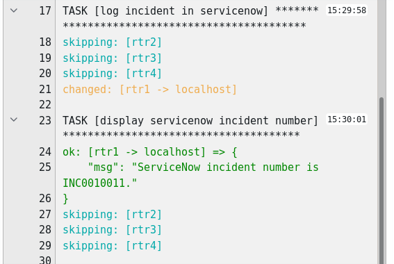

# Exercise 4-5: Configuration Drift

## Table of Contents

- [Objective](#objective)
- [Guide](#guide)
- [Solution](#solution)

# Objective

In this exercise we will use Ansible to check the configuration of our routers. If we detect any drift then we will put the device back into our desired state and log an incident in ServiceNow.

# Guide

## Step 1:

To use the ServiceNow module we need to install the pysnow python module. On your Ansible Control/Tower node install the module.

```bash
sudo pip install pysnow 
```

## Step 2: 

We need to add a new project to gain access to some additional playbooks. Click on the Projects link on the left menu.

Click the `+` green button to create a new project.  Fill out the following fields.

| Parameter | Value |
|---|---|
| Name  | Extra Labs Project  |
| Organization |  Default |
| SCM TYPE |  Git |
| SCM URL |  https://github.com/pharriso/tower_workshop |
|SCM UPDATE OPTIONS| [x] Clean <br />  [x] Delete on Update<br />  [x] Update on Launch

Click on the Green Save button to save the new project.

## Step 3:

Now we can add a new job template.

Click on the green `+` button to create a new job template (make sure to select `Job Template` and not `Workflow Template`)

| Parameter | Value |
|---|---|
| Name  | SNMP CONFIG  |
|  Job Type |  Run |
|  Inventory |  Workshop Inventory |
|  Project |  Extra Labs Project |
|  Playbook |  snmp_config.yml |
|  Credential |  Workshop Credential |

Now add the following into EXTRA VARIABLES:
```bash
snow_user: <instructor to provide>
snow_password: <instructor to provide> 
snow_instance: <instructor to provide>
```

Scroll down and click the green `save` button.

## Step 4

Let's launch the job template. We shouldn't see any changes being made during the job run and as a result we don't need to raise an incident in ServiceNow.

## Step 5

Log onto one of our routers and make a change outside of the control of our automation. 

```bash
ssh rtr1
rtr1#conf t
rtr1(config)#no snmp-server community ansible-public RO
```

Now execute our **ROUTER CONFIG** job again. This time we should see some changes being made and a ServiceNow incident should be raised. The incident number is reported as part of the job output as well.



## Step 6

Log into ServiceNow - https://<< instance name >>.service-now.com. Use the same credentials you passed into your job template as variables.

In the left hand pane, click on incidents and you should see your incident number. Click on your incident and you will see a comment in the ticket that says "Configuration drift detected in tower job ID XX". This job ID matches the Job ID in your Tower instance so you can easily tie the ServiceNow incident with the Ansible Tower job.

# Solution
You have finished this exercise. We have used Ansible to check the configuration of our routers and report any configuration drift as an incident in ServiceNow.

[Click here to return to the lab guide](../README.md)
