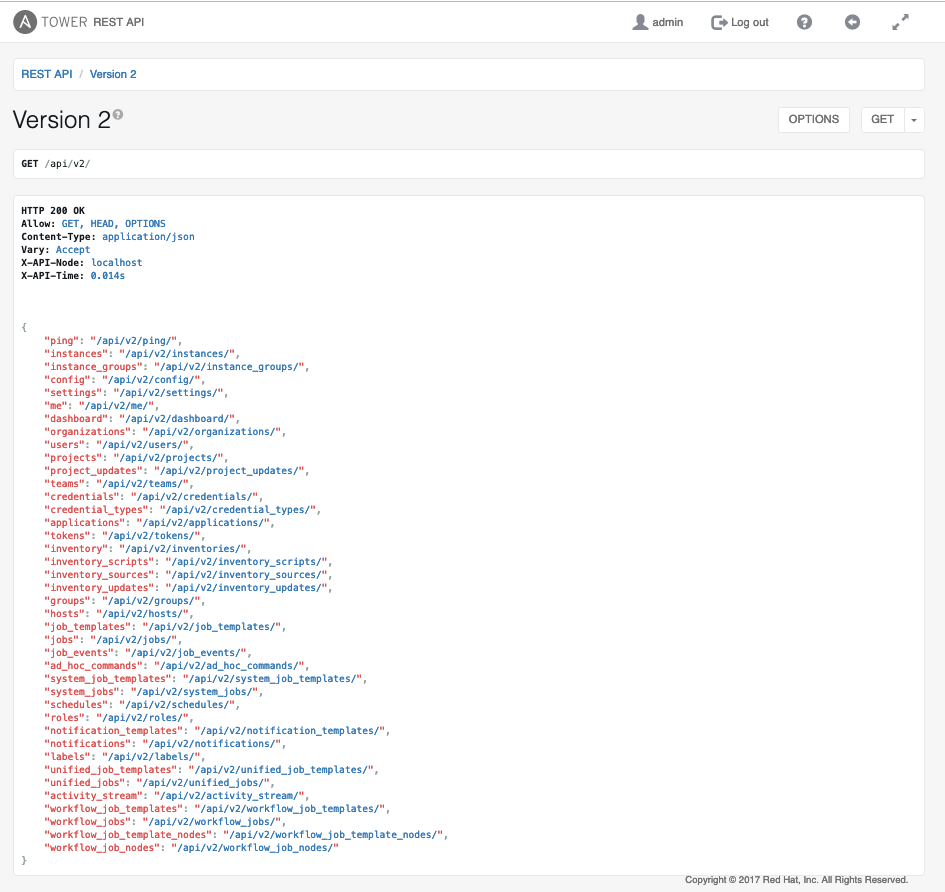

# Exercise 7 - Tower API

Ansible Tower has a RESTFUL API, which we'll explore a little here. This means that Tower allows us to move away from CLI driven automation with Ansible to API driven automation. An example use case may be to call the Ansible Tower API from a 3rd party system such as ServiceNow or perhaps part of a CI/CD pipeline.

To explore the API navigate to https://*public_IP*/api/v2/ where *public_IP* is the public IP of your Tower instance.



## Calling the API to check status:

Calling the API ping can be a useful 'health' check. https://*public_IP*/api/v2/ping/


## Calling the API to launch a job

We can call into Ansible Tower via the API to run a job template for us.

We'll use the "Install Apache" job template that we created earlier.

### Find the Job ID

We need to find the job ID so we can launch it via the api. In the Tower UI got to `Templates` and then click on `Install Apache` job template. In the url you will see the job ID. For example - https://X.X.X.X/#/templates/job_template/8 - This shows my job ID is `8`.


### Launch the job

We'll use the *curl* command to launch the job. It's a bit of a handful but let's break it down, so it's easier to understand:

```bash
-- user:    who we authenticate as. In our case the admin account
-k:         insecure HTTPS. So we don't check for valid certs
-s:         silent mode. Cuts out some of the not so -useful curl output we don't want
-H:         HTTP JSON MIME type headers. We need to POST in the extra_vars and job_tags so the job will run successfully
```

NB. You will need to check and change where necessary the PUBLIC_IP for your Tower instance and the Job Template number (mine here is 8)

Lastly, we use a little bit of python magic to prettify the output, making it more readable.

**NOTE**
Make sure you update the password below from PASSWORD to your Tower admin password. You also need to update the IP address in the URL to be the public IP address of your Tower server. Finally, you also need to update your job template ID. In the below example we are using job template ID 8 - https://X.X.X.X/api/v2/job_templates/`8`/launch/

---


```bash
curl --user 'admin':'PASSWORD' -k -s -H 'Content-Type: application/json' -k -s -XPOST https://X.X.X.X/api/v2/job_templates/8/launch/ | python -m json.tool
```

You should see some output from the job launch including the ID of this particular job run.

```bash
    },
    "timeout": 0,
    "type": "job",
    "unified_job_template": 8,
    "url": "/api/v2/jobs/`58`/",
    "use_fact_cache": false,
    "vault_credential": null,
    "verbosity": 0
}
```

## Checking The Job

From the above output, I can see that `job 58` was created. We can check in the Ansible Tower UI for that job ID to see the output. 

---

[Click Here to return to the Ansible Tower Workshop](../README.md)
